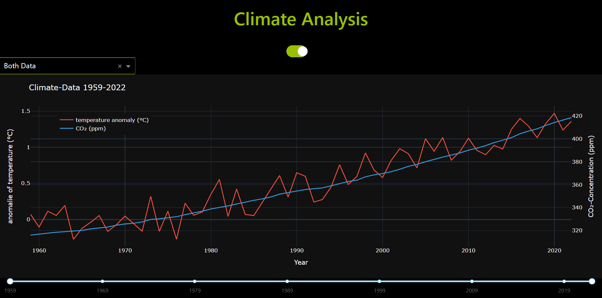

# climate

**Graph Description: Climate Analysis (1959–2022)**  

The graph "Climate Analysis" compares the evolution of global temperature anomalies and atmospheric CO₂ concentrations from 1959 to 2022. It visualizes two critical climate indicators in a unified framework, highlighting their parallel rise and the correlation between greenhouse gas emissions and global warming.  

**Temperature Anomalies (Left Y-Axis):**  
The red curve represents deviations in global average temperatures from the 1951–1980 baseline. Starting near **-0.5°C** in the late 1950s, anomalies steadily increase, surpassing **+1.5°C** by 2022. This upward trend reflects accelerated warming since the 1980s, aligning with industrialization and rising fossil fuel consumption.  

**CO₂ Concentrations (Right Y-Axis):**  
The blue curve depicts CO₂ levels (in parts per million, ppm) measured at Mauna Loa Observatory. Beginning at **~320 ppm** in 1959, concentrations exceed **400 ppm** by 2022—a threshold unseen in the past 800,000 years. The shaded uncertainty band (±0.12 ppm) reflects measurement precision but underscores the data’s reliability.  

**Key Insights:**  
The synchronized trajectories of both metrics underscore humanity’s profound impact on Earth’s climate. The near-exponential rise in CO₂, driven by fossil fuel combustion and deforestation, directly correlates with rising temperatures. The post-1990 acceleration aligns with industrialization in emerging economies and intensified global emissions.  

**Data Sources:**  
- **CO₂ Data:** National Oceanic and Atmospheric Administration (NOAA), Global Monitoring Laboratory (GML)  
- **Temperature Data:** Berkeley Earth Surface Temperature Project  

**Visualization:**  
The dual-axis design facilitates direct comparison, with a shared timeline (X-axis) enabling synchronous analysis. The graph emphasizes the urgency of climate mitigation and serves as a scientific foundation for policy and societal action. This synthesis of data underscores the need for rapid decarbonization to curb further warming.
